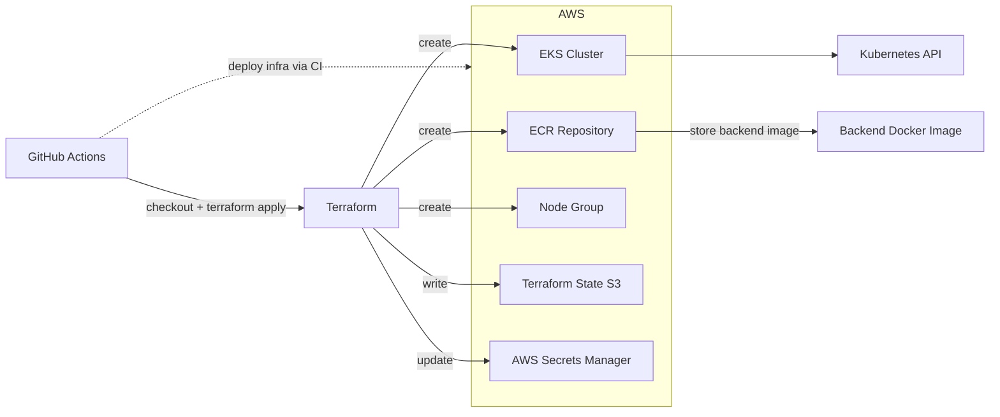

# pitflow-cluster-kubernetes

## Descrição

Este repositório provisiona a infraestrutura AWS necessária para o projeto Pitflow OS, criando:

- Um cluster Kubernetes gerenciado com Amazon EKS.
- Um repositório de container registry com Amazon ECR para armazenar a imagem do backend do `pitflow-os`.
- Um workflow GitHub Actions que automatiza a aplicação do Terraform e atualiza os dados no AWS Secrets Manager.

> O repositório não cria a imagem do backend nem faz o deploy da aplicação no cluster; ele entrega a infraestrutura de base para esses próximos passos.

## Tecnologias utilizadas

- Terraform
- AWS EKS
- AWS ECR
- AWS Secrets Manager
- GitHub Actions
- AWS Provider para Terraform
- Helm Provider para Terraform
- Kubernetes Provider para Terraform

## Recursos provisionados

- `aws_eks_cluster.pitflow_cluster`: cluster EKS chamado `pitflow-eks`.
- `aws_eks_node_group.pitflow_nodes`: grupo de nós EKS com instâncias `t3.medium` em modo SPOT.
- `aws_ecr_repository.backend`: repositório ECR chamado `pitflow-os-backend`.
- `helm_release.cluster_autoscaler`: Cluster Autoscaler instalado via Helm no namespace `kube-system`.


## Arquitetura



## Pré-requisitos

- AWS CLI configurado ou credenciais válidas em `~/.aws/credentials`.
- Terraform instalado localmente.

## Passos para execução local

1. Clone o repositório:

```bash
git clone <repo-url>
cd pitflow-cluster-kubernetes/infra/terraform
```

2. Inicialize o Terraform, 
- OBS: caso for utilizar `tfstate` local, comentar o conteúdo de [backend.tf](infra/terraform/backend.tf), caso contrário é necessário ter o S3: `tfstate-backend-fiap-pitflow`

```bash
terraform init
```

3. Verifique o formato:

```bash
terraform fmt -check
```

4. Valide a configuração:

```bash
terraform validate
```

5. Gere e aplique o plano:

```bash
terraform plan -out=main.tfplan
terraform apply -auto-approve main.tfplan
```

## Deploy via GitHub Actions

O workflow está definido em `.github/workflows/main.yaml` e é acionado em `push` para `main` ou manualmente via `workflow_dispatch`.

Ele realiza:

- Configuração de credenciais AWS usando secrets.
- Inicialização e validação do Terraform.
- Aplicação do plano Terraform.
- Captura do URL do repositório ECR e do nome do cluster EKS.
- Atualização do segredo `pitflow/bootstrap` no AWS Secrets Manager.

## Observações importantes

- O cluster EKS usa sub-redes do VPC padrão de `us-east-1` e exclui `us-east-1e` explicitamente no filtro de subnets.
- O grupo de nós EKS usa instâncias `SPOT`; os custos e disponibilidade podem variar.
- O backend de estado do Terraform é armazenado em um bucket S3 existente: `tfstate-backend-fiap-pitflow`.

