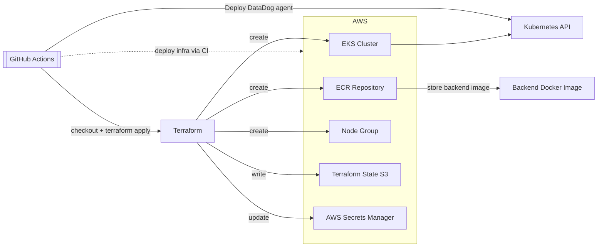

# pitflow-cluster-kubernetes

## Descrição

Este repositório provisiona a infraestrutura AWS necessária para o projeto Pitflow OS, criando:

- Um cluster Kubernetes gerenciado com Amazon EKS.
- Um repositório ECR compartilhado pelas imagens dos serviços PitFlow.
- AWS Load Balancer Controller e um Application Load Balancer compartilhado.
- API Gateway, rotas para Lambdas e proxy HTTP para o ALB.
- Um workflow GitHub Actions que automatiza toda a plataforma e atualiza os dados no AWS Secrets Manager.
- Configura o agente do Datadog.

> O repositório não cria a imagem do backend nem faz o deploy da aplicação no cluster; ele entrega a infraestrutura de base para esses próximos passos.

## Tecnologias utilizadas

- Terraform
- AWS EKS
- AWS ECR
- AWS Secrets Manager
- AWS Load Balancer Controller
- Amazon API Gateway
- GitHub Actions
- AWS Provider para Terraform
- Helm Provider para Terraform
- Kubernetes Provider para Terraform

## Recursos provisionados

- `aws_eks_cluster.pitflow_cluster`: cluster EKS chamado `pitflow-eks`.
- `aws_eks_node_group.pitflow_nodes`: grupo de nós EKS com instâncias `t3.medium` em modo SPOT.
- `aws_ecr_repository.backend`: repositório ECR chamado `pitflow-os-backend`.
- `helm_release.cluster_autoscaler`: Cluster Autoscaler instalado via Helm no namespace `kube-system`.
- `helm_release.aws_load_balancer_controller`: controller que reconcilia os recursos Ingress de classe `alb`.
- `kubernetes_ingress_v1.pitflow_edge`: entrada base que cria o ALB antes dos serviços de negócio.
- `aws_apigatewayv2_api.pitflow`: API Gateway, rotas, integrações e permissões para invocação das Lambdas.


## Arquitetura



## Pré-requisitos

- AWS CLI configurado ou credenciais válidas em `~/.aws/credentials`.
- Terraform instalado localmente.

## Passos para execução local

1. Clone o repositório:

```bash
git clone <repo-url>
cd pitflow-cluster-kubernetes/infra/terraform
```

2. Inicialize o Terraform, 
- OBS: caso for utilizar `tfstate` local, comentar o conteúdo de [backend.tf](infra/terraform/backend.tf), caso contrário é necessário ter o S3: `tfstate-backend-pitflow-bootstrap`

```bash
terraform init
```

3. Verifique o formato:

```bash
terraform fmt -check
```

4. Valide a configuração:

```bash
terraform validate
```

5. Gere e aplique o plano:

```bash
terraform plan -out=main.tfplan
terraform apply -auto-approve main.tfplan
```

## Deploy via GitHub Actions

O workflow `.github/workflows/main.yaml` cria toda a plataforma:

- EKS, node group e ECR;
- Metrics Server, Cluster Autoscaler e Datadog;
- AWS Load Balancer Controller;
- Ingress e ALB compartilhados;
- cria o API Gateway e suas rotas;
- configura a integração HTTP com o ALB;
- concede ao API Gateway permissão para invocar as Lambdas;
- publica `ECR_URL`, `EKS_CLUSTER_NAME`, `LB_URL` e `API_PUBLIC_URL` em `pitflow/bootstrap`.

No primeiro provisionamento, o Terraform cria o API Gateway com uma URL de
origem provisória válida. Depois que o controller publica o DNS do ALB, o
workflow grava `LB_URL` no Secrets Manager e executa uma segunda reconciliação
no mesmo estado Terraform para atualizar a integração HTTP.

## Ordem de provisionamento

Para uma criação completa:

1. Execute `pitflow-bootstrap`.
2. Execute `pitflow-database`.
3. Execute `pitflow-lambdas`.
4. Execute o workflow principal deste repositório.
5. Execute os pipelines das aplicações.

As Lambdas são criadas antes do cluster porque o Terraform consulta as funções
ao criar as integrações e permissões do API Gateway. Todo o Terraform deste
repositório usa o mesmo root e o mesmo estado.

## Observações importantes

- O cluster EKS usa sub-redes do VPC padrão de `us-east-1` e exclui `us-east-1e` explicitamente no filtro de subnets.
- O grupo de nós EKS usa instâncias `SPOT`; os custos e disponibilidade podem variar.
- O backend de estado do Terraform é armazenado em um bucket S3 existente: `tfstate-backend-pitflow-bootstrap`.
- O AWS Load Balancer Controller usa as credenciais disponíveis aos nodes por meio da `LabRole`; a role precisa permitir as operações EC2 e ELB exigidas pelo controller.
- Todos os valores de configuração continuam centralizados no secret `pitflow/bootstrap`.
- O ECR é singular; os serviços devem usar tags com prefixo do serviço e SHA do commit.
